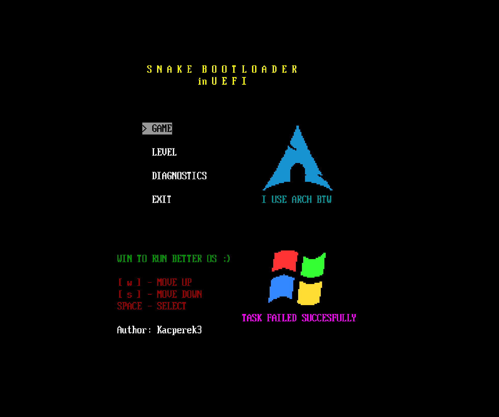
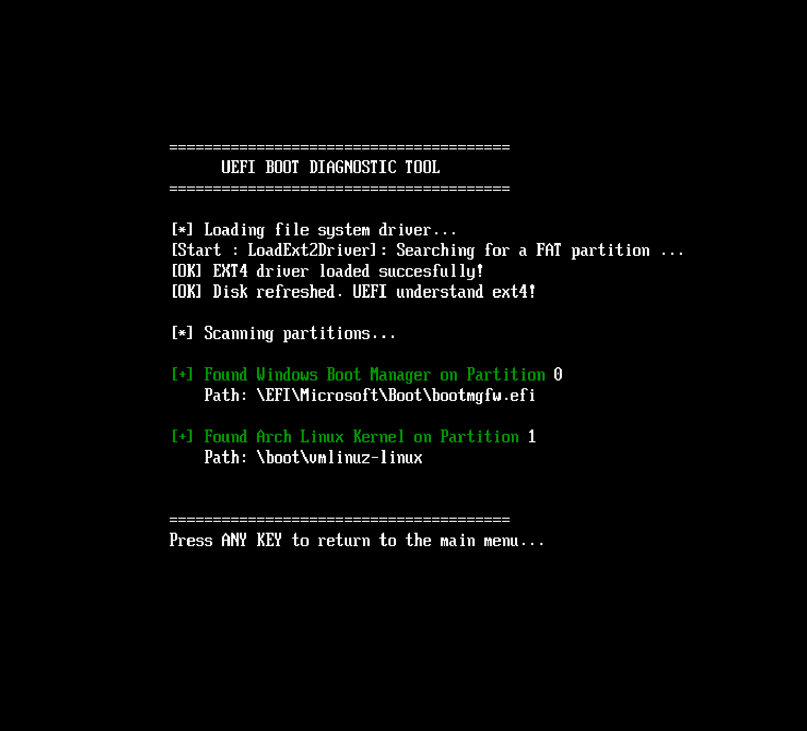
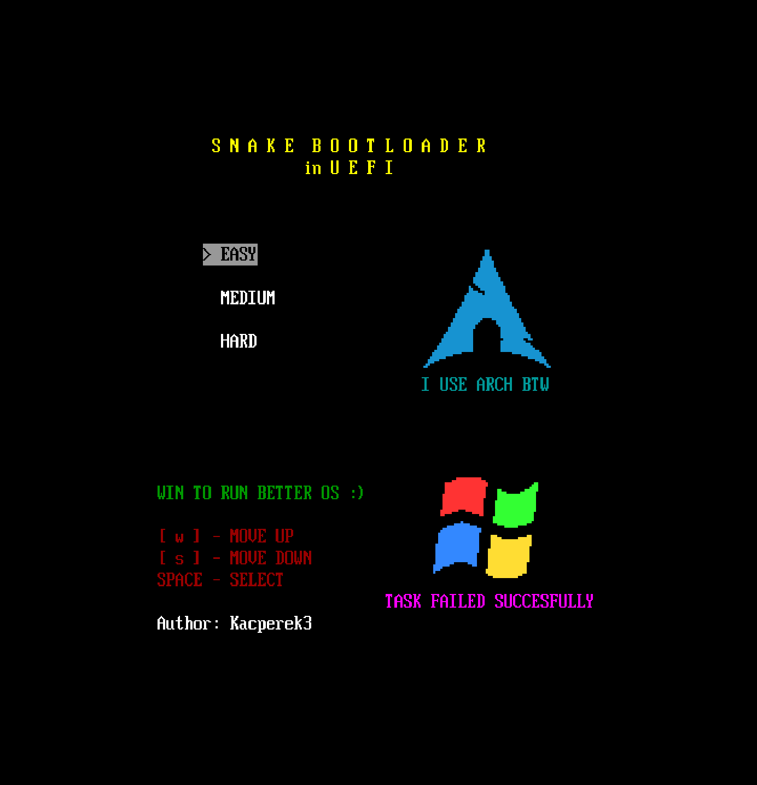
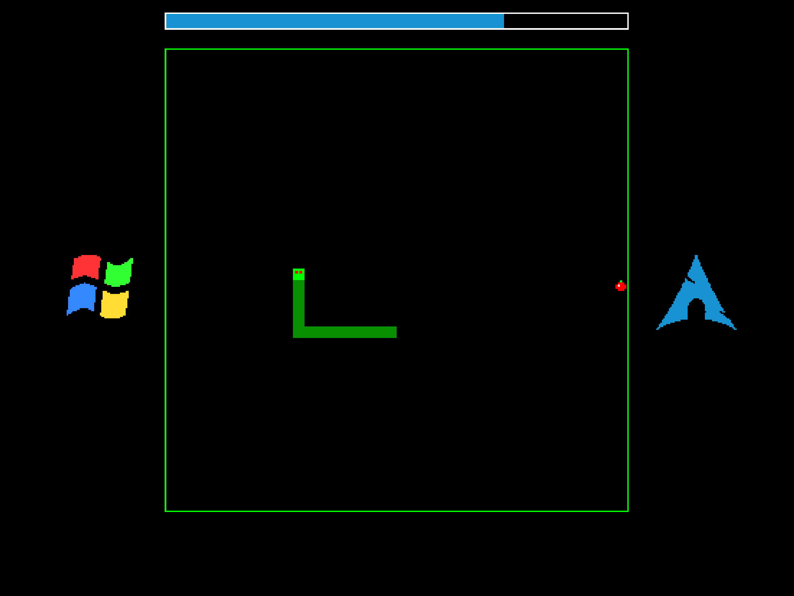
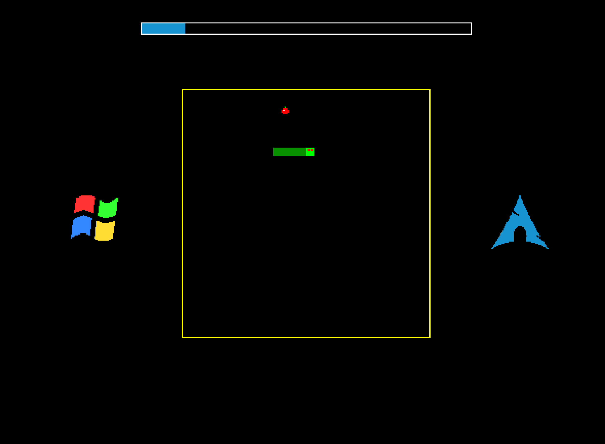
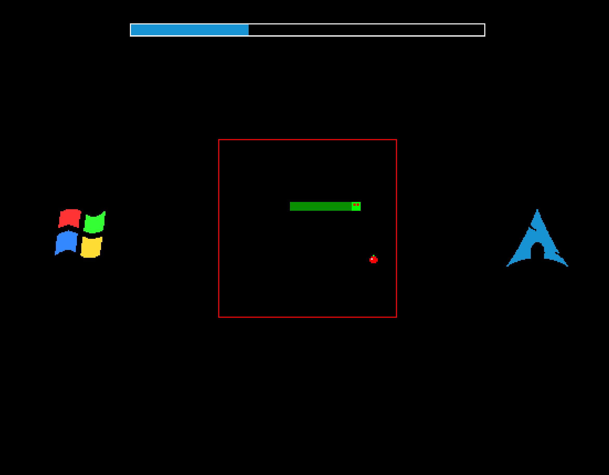

# Snake Bootloader in UEFI

A bare-metal, gamified UEFI dual-boot manager written in pure C. This project replaces the standard system boot menu with a fully functional arcade game operating directly in the pre-boot environment.

The main premise of the bootloader is simple but unforgiving:
* **Win the game (eat 15 apples):** The system boots Arch Linux.
* **Lose the game (hit a wall or yourself):** The system boots Windows.


## Screenshots

### Main Interface

*The primary dual-boot interface featuring custom pixel-mapped logos.*

### Diagnostic Tool

*Built-in partition scanner verifying the exact physical locations of the Linux Kernel and the Windows Boot Manager (bootmgfw.efi).*

### Gameplay Levels

To ensure a cohesive and professional presentation, the four primary graphical states of the bootloader are presented below in a precise grid layout.

| | |
| :---: | :---: |
| <br><b>Level Selection Menu</b><br>*Navigate using W/S and confirm with SPACE.* | <br><b>Level 1: Easy Mode</b><br>*Spacious 40x40 Grid, slow snake speed.* |
| <br><b>Level 2: Medium Mode</b><br>*Balanced 30x30 Grid, moderate speed.* | <br><b>Level 3: Hard Mode</b><br>*Claustrophobic 20x20 Grid, extreme speed.* |

## Architecture and Technical Highlights

This project is not just a game; it is a custom-built, lightweight operating system environment designed to interface directly with motherboard firmware. It showcases advanced UEFI concepts and manual hardware manipulation.

* **Dynamic Filesystem Driver Injection:** Standard UEFI firmware is strictly limited to reading FAT32 partitions (EFI System Partition). To boot Arch Linux, this bootloader programmatically loads an external driver (`ext2_x64.efi`) into memory, binds it to the hardware Block I/O controllers, and dynamically refreshes the disk handles. This allows the pre-boot environment to mount EXT4 partitions and locate the `vmlinuz-linux` kernel on the fly.
* **Custom Graphics Engine via GOP:** Bypassing the severe limitations of standard UEFI text output, the bootloader utilizes the Graphics Output Protocol (GOP) to acquire the linear framebuffer address. All game rendering, framing, and UI elements are drawn by manipulating raw memory pixels.
* **Hybrid Pixel-Perfect Rendering:** The bootloader features a custom engine capable of parsing Braille ASCII art and mapping it to exact pixel coordinates. It calculates isometric perspectives and applies specific color grading to individual dots within a character matrix, ensuring crisp, high-fidelity logos.
* **Game State Machine:** The entire application architecture is built upon a robust State Machine pattern (Menu State, Snake State, Options Manager). It handles memory efficiently and ensures smooth transitions between the graphical game loop and the diagnostic text modes without memory leaks.


##  Building and Running

To ensure easy build process, all necessary UEFI headers (`uefi_inc`) are bundled directly within the repository. There is no need to install or configure heavy frameworks like EDK II or `gnu-efi`.

### Prerequisites
You only need a standard C cross-compilation toolchain and an emulator for testing:
* `make`
* `gcc` (or `clang` / `mingw-w64` depending on your setup)
* `qemu` (specifically `qemu-system-x86_64` and OVMF firmware)

### Compilation
Clone the repository and navigate to the project directory:
   ```bash
   git clone https://github.com/Kacperek3/Uefi-Snake.git
   cd UEFI_SNAKE
   make
   make run
```

## Running on Real Hardware (USB Boot)

Testing in QEMU is safe, but this bootloader is usable to run on bare metal. You can easily run it to any physical machine using a standard USB flash drive.

### Preparation
1. Prepare a USB flash drive and format it to **FAT32** (UEFI standard requirement).
2. Create the default UEFI fallback directory structure on the root of your USB drive:
   ```bash
   mkdir -p /mnt/usb/EFI/BOOT
   ```

### Installation
3. Copy your compiled bootloader and the filesystem driver into the newly nce booted physically, the Diagnostics menu will scan your actual motherboard's NVMe/SATA drives to locate your real Windows and Arch Linux partitions.

created directory. The UEFI firmware will automatically look for the `BOOTX64.EFI` executable.
   ```bash
   cp BOOTX64.EFI /mnt/usb/EFI/BOOT/
   cp ext2_x64.efi /mnt/usb/EFI/BOOT/
   ```

### Booting
4. Reboot your computer and enter your motherboard's BIOS/UEFI firmware settings.
5. **Disable Secure Boot.** *(This bootloader is not signed by Microsoft's CA, so Secure Boot must be disabled to allow execution).*
6. Open your boot menu and select the USB Flash Drive.

*Note: Once booted physically, the Diagnostics menu will scan your actual motherboard's NVMe/SATA drives to locate your real Windows and Arch Linux partitions.*
### Credits and Acknowledgments
* The Braille-based ASCII art used for the operating system logos was sourced from external community creators and adapted for this custom rendering engine.
* EXT4 driver implementation relies on the standard `ext2_x64.efi` to bridge the gap between UEFI and Linux filesystems.

## License

This project is licensed under the **MIT License** - See the [LICENSE](LICENSE) file for details.